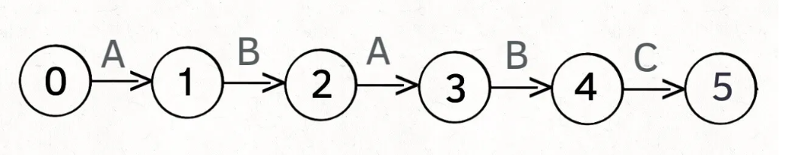
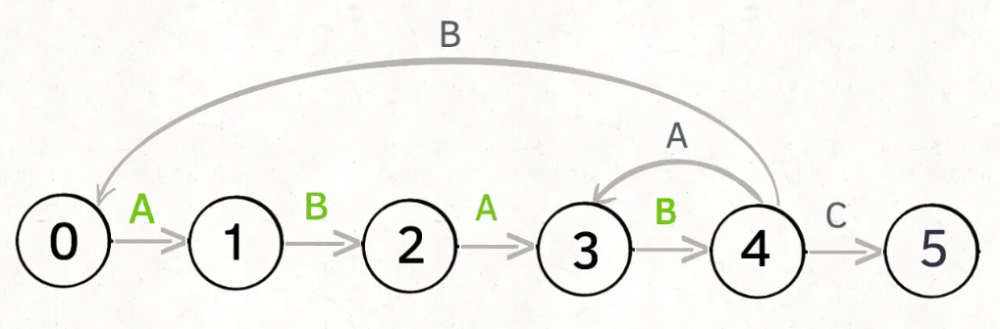

# String Matching
## KWP(Knuth-Morris-Pratt)Algorithm
当我们使用文档阅读器的时候，我们想查找某种特定的词语有关的内容，这时候我们往往会使用Ctrl+F来打开搜索功能，假设我们要在长度为**N**的文本**txt**中查找长度为**M**的模式串**pat**, 如果找到，我们返回这个子串的起始索引，否则返回-1。通常的想法复杂度是O(nm)这显然是一个非常大的计算量，那么我们有没有更为优化的算法呢？我们考虑以下情况
* txt = "aaacaaab", pat = "aaab"
	 传统的方法来看，使用指针i指向txt的其匹配起始点，j指向pat的匹配点
	 去看pat[j]是否等于txt[i+j]
	 如果等，j++;
	 如果不等，i++,j=0;
	但在实际上当我们发现c!=b的时候，基于我们知道pat中没有c的知识，我们应该直接从c后面那个a开始尝试匹配，这样以来两轮就完成了搜索
* txt = "aaaaaaab" pat = "aaab"
	当我们发现a!=b时，基于b的前一个数是a的知识，我们只需要不断比较txt[i+1]是否等于b即可。并不需要又从第一个字符开始逐一匹配。
综上我们发现，在一定情况下我们可以通过记录pat的一定信息来优化普通算法

***那我们如何来记录pat的信息呢？***
首先这个信息是基于pat来生成的，

***那么以一种怎样的方法来pat来构建储存信息的数组呢？***
我们不妨把pat的匹配程度看为一个***有限状态机***

我们把初始状态称为0，如果每个字符匹配成功就进入下一个状态，当进入到状态（pat.len）的时候就匹配成功了。
***那么每次字符匹配失败的时候我们接下来该看pat里面的哪个字符呢？***

以到状态4为例，如果接下来这个字符是A，即字符串是ABABA，我们回到状态3即可，若接下来字符是B，则字符串是ABABB，我们则需要回到状态0，不同的状态在代码层面表现出来就是指针j该往哪儿移动。j指针移动的优化。

***现在我们通过人脑计算这种状态数较少的情况来告诉计算机每一步在遇到不同的字符时接下来指针j该往哪儿移***
指针j的移动方式与两个参数：当前状态，下一个遇到的字符，两个参数有关，所以我们构造一个二维数组来存储
`dp[j][c]=next`
其中j表示当前状态，c表示下一个遇到的字符的ASCII码(这样可以通过限制c的范围来表示遇到其他字符的情况)，next表示下一个状态
以上图为例表现为
`dp[4]['A']=3, dp[4]['B']=0, dp[4]['C']=5, dp[4]['其他字符']=0` 

***那计算机如何自己计算下一步该往哪儿移呢?***
* 如果下一个字符匹配正确则状态+1，即`dp\[j]\[pat\[i]]=j+1`
* 如果下一个字符匹配失败则j指针只能回退，但我们希望它尽可能少地回退
	* 我们发现其实pat字串是存在重复性的，图片示例中是一个比较理想的情况，当pat字符串是ABABC的时候，ABAB是重复的，因此当下一个字符出现A时，其实只需要回到状态3即可，因为我们发现状态2和状态4具有相同的前缀AB，我们姑且把状态2称为状态4的“退化状态”即其实我们可以把状态4看作一种更严苛的状态2，因此回退时我们优先考虑能不能回到状态2，而不是一夜回到解放前。更一般的，若pat字串是ABCD那我们可以发现并没有重复部分，但我们可以把所有状态的“退化状态”定为状态0，再比如AABB我们就可以发现状态1的“退化状态”是状态0，状态3的“退化状态”是状态2，到这里大家应该已经想设计一个算法来更新和维护退化状态了吧，以下是完整代码

```java
public class KMP{

	//状态数组来存储每一个状态在遇到特定字符时候该去往哪个状态
	private int[][] dp;
	//每一个KMP匹配状态机的构造只与待匹配的字串pat有关
	private String pat;
	
	public KMP(String pat){
		//根据传入的待匹配字串pat生成KMP匹配状态机
		this.pat=pat
		
		//pat的匹配到每一个字符对应一个状态，下一个遇到的字符的ASCII码一定在0~256
		dp=new int[pat.length()][256];
		
		//initialization
		//如果状态0匹配到目标串的第一个字符则下一个状态为状态1
		dp[0][pat.charAt(0)]=1;
		//状态0和状态1的退化状态都是状态0，先初始化退化状态为状态0
		int x=0;
		
		//接着构建状态转移图,说明匹配到每一个字符接下来的状态该是什么
		for(int j=1;j<pat.length();j++){
			//先默认所有状态不管遇到啥下一状态都退回到当前退化状态的下一状态
			for(int c=0;c<256;c++){
				dp[j][c]=dp[x][c]
			}
			//所有状态如果匹配正确则进入下一状态
			dp[j][pat.charAt(j)]=j+1;
			
			//如果当前字符能让退化状态进步，则更新退化状态
			x=dp[x][pat.charAt(j)];
		}
	}
	
	public int search(String txt){
		//检索txt
		//初始化状态为j=0
		int j=0
		for(int i=0;i<txt.length();i++){
			//看看遇到下一个字符时候根据状态图更新状态
			j=dp[j][txt.charAt(i)];
			//检查是否到达终止态
			if(j==pat.length()) return i-(pat.length()-1);
			
		}
		//没到达终止态说明匹配失败
		return -1;
	}
}
```
>[!info] Reference
>[KMP 算法详解 - 知乎 (zhihu.com)](https://zhuanlan.zhihu.com/p/83334559)


